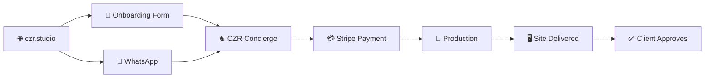
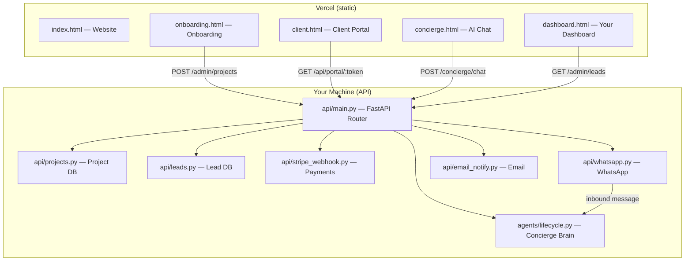
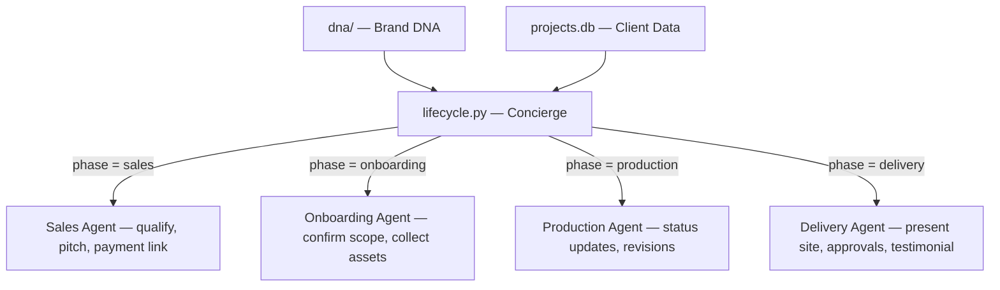

# CZR Studio — How It Works

## The Big Picture

CZR Studio is a **full-stack AI-powered web agency**. A client lands on your website, talks to your AI concierge, pays, gets a site built, reviews it, approves it — all automated.



---

## Architecture

Two systems, one domain:

| System | Where it runs | What it does |
|---|---|---|
| **Static site** (`czr.studio`) | Vercel | Website, onboarding form, client portal, concierge chat, dashboard |
| **API server** (`api.czr.studio`) | Your machine + Cloudflare Tunnel | All backend logic: AI, payments, WhatsApp, email, database |



---

## The Concierge (Core Engine)

The concierge is one AI identity that adapts per phase. It powers **every** client conversation — WhatsApp and web chat.



**What gets injected into every AI call:**
1. **DNA identity** — brand name, tagline, guarantee, voice tone, banned words
2. **Client dossier** — name, email, phone, package, phase, brief, pending revisions
3. **Phase instructions** — what to do in this phase, when to advance

---

## Databases

Two SQLite files, created automatically:

| File | Tables | Purpose |
|---|---|---|
| `projects.db` | projects, messages, events, revisions, assets, payments | Full client lifecycle |
| `leads.db` | leads | Sales pipeline (pre-client) |

---

## File Map

| Folder | What's inside |
|---|---|
| **`api/`** | FastAPI server — routes, DB, webhooks, email, social posting |
| **`agents/`** | AI system — concierge brain, phase agents, tools |
| **`dna/`** | Brand DNA — identity, voice, visual, content rules, contracts |
| **`brand/`** | Brand assets — logos, typography, guidelines, social templates |
| **`cases/`** | Portfolio case studies (each is a standalone mini-site) |
| **`data/`** | Logs, audit reports, campaign journals |

---

## Client Journey (step by step)

| Step | What happens | Code |
|---|---|---|
| 1. **Visit** | Client lands on `czr.studio` | `index.html` |
| 2. **Contact** | Client fills onboarding form OR sends WhatsApp | `onboarding.html` / `api/whatsapp.py` |
| 3. **Qualify** | Concierge (sales phase) qualifies, pitches package | `agents/phases/onboarding.py` |
| 4. **Pay** | Stripe checkout link → payment confirmed → phase advances | `api/stripe_webhook.py` |
| 5. **Brief** | Concierge collects detailed brief + assets | `agents/phases/briefing.py` |
| 6. **Build** | You build the site. Client gets status updates | `agents/phases/concierge.py` |
| 7. **Review** | Client sees the site, submits revisions via portal | `client.html` |
| 8. **Approve** | Client approves, gives testimonial | `agents/phases/delivery.py` |

---

## How to Run

```bash
# Start everything
./start_czr.sh
```

This does:
1. Loads `api/.env`
2. Starts FastAPI on port 8901
3. Opens Cloudflare Tunnel → `api.czr.studio`

---

## External Services You Need

| Service | What for | How to get |
|---|---|---|
| **Gemini** | Concierge AI brain | [ai.google.dev](https://ai.google.dev) → API key |
| **Stripe** | Payments | [stripe.com](https://stripe.com) → secret key + webhook secret |
| **WhatsApp Cloud API** | Client messaging | [developers.facebook.com](https://developers.facebook.com) → WhatsApp setup |
| **SMTP** (any provider) | Email notifications | Gmail app password, or Resend/Postmark |
| **Cloudflare** | Tunnel (API hosting) | [cloudflare.com](https://cloudflare.com) → Zero Trust → Tunnels |
| **Vercel** | Static site hosting | Already deployed |
